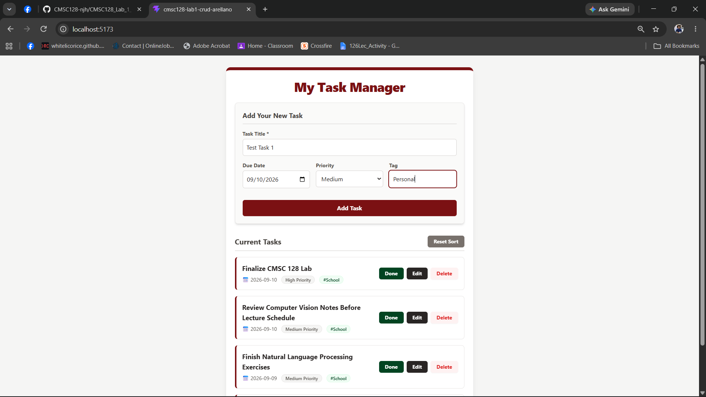
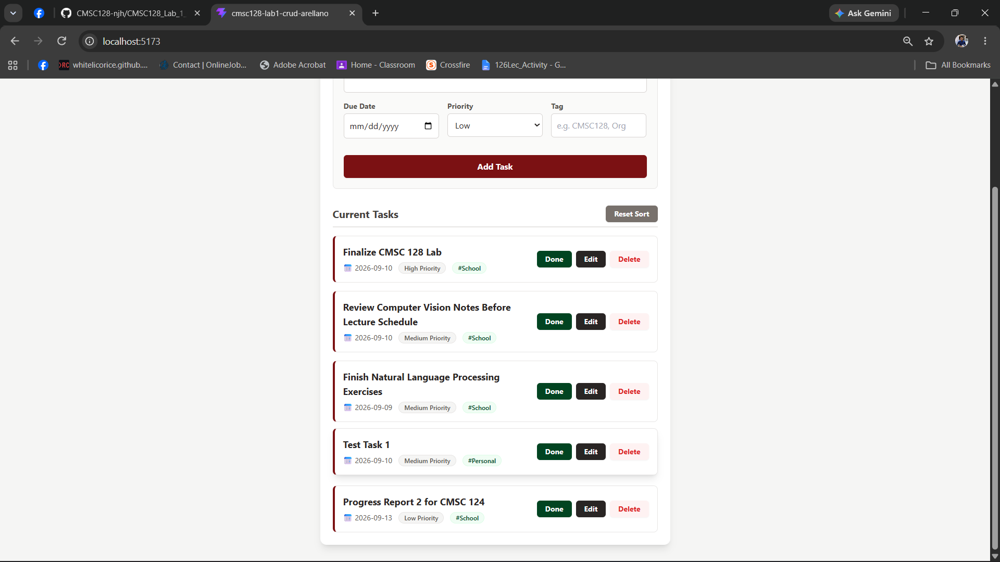
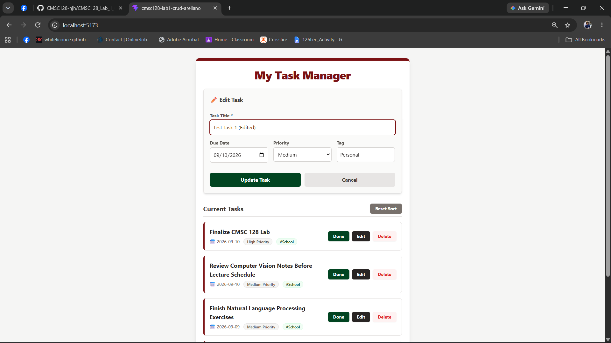
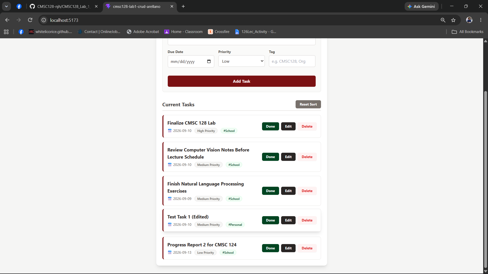
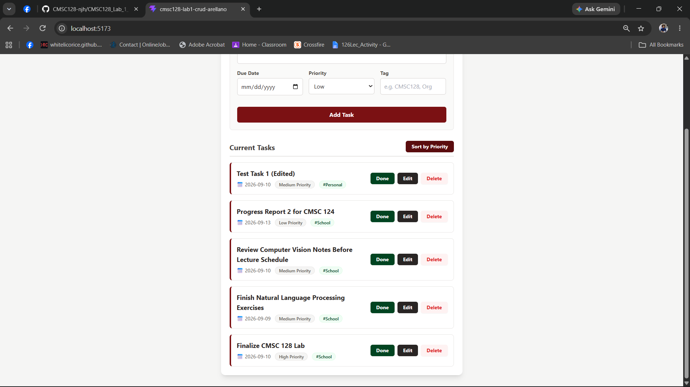
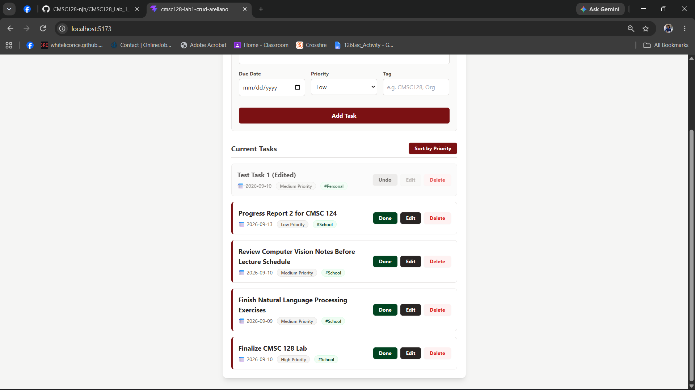
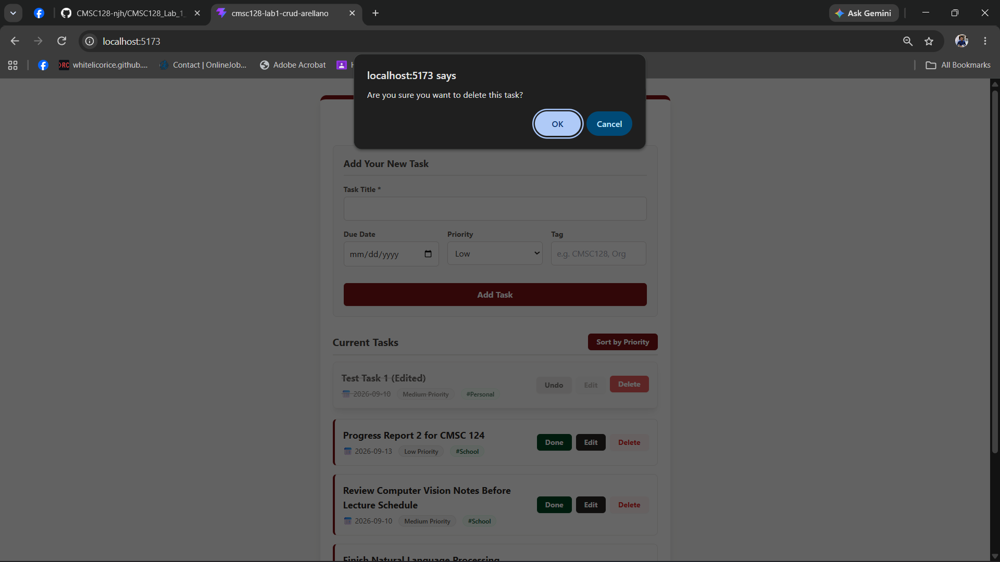
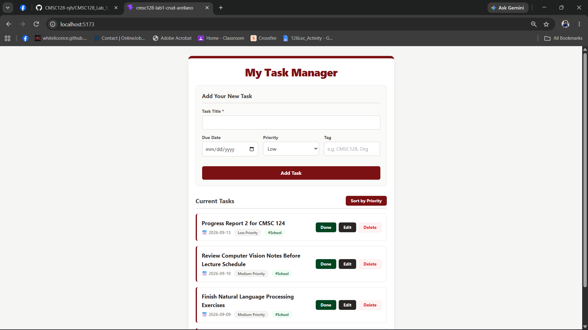

# UP Task Manager (CMSC 128 Lab 1)
**Author:** Junel Arellano

## Tech Stack & Database
*   **Frontend:** React (bootstrapped with Vite)
*   **Styling:** Tailwind CSS (Custom UP Maroon & Green theme)
*   **Database/Backend:** Supabase (PostgreSQL)

**Why this stack?** 
React and Vite allow for rapid, component-based UI development with instant hot-reloading. Tailwind CSS makes implementing the custom branding fast and efficient without needing to manage separate CSS stylesheets. Supabase was chosen as the Backend-as-a-Service (BaaS) because it provides a robust PostgreSQL database with a simple, secure JavaScript API, eliminating the need to write and host a custom backend server for these lab requirements.

## Setup & Local Development
1. Clone the repository to your local machine.
2. Navigate into the project directory: 
   `cd cmsc128-Lab1_CRUD_Arellano`
3. Install the required Node dependencies: 
   `npm install`
4. **Environment Variables:** Create a `.env.local` file in the root directory and add your Supabase credentials to securely connect to the database (this file is ignored by Git):
   ```env
   VITE_SUPABASE_URL=your_supabase_project_url
   VITE_SUPABASE_ANON_KEY=your_supabase_anon_key

**Screenshots of the App:**







